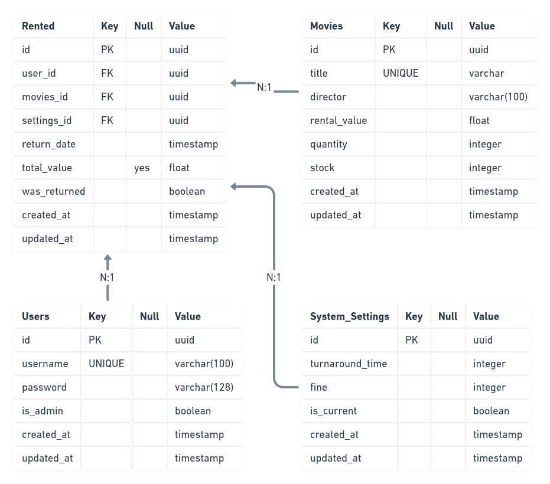

# _LOCKDOWN MOVIES_

> Uma locadora de grande porte está precisando melhorar a forma de locação de seus filmes, a fim de proporcionar facilidade e praticidade para que os seus clientes possam alugar os filmes diretamente de suas casas.

## _INSTRUÇÕES_

- Criar container do postgres:

```
docker run --name postgres -e POSTGRES_USER=postgres -e POSTGRES_PASSWORD=docker -p 5432:5432 -d postgres:14
```

- Criar banco de dados dev:

```
docker exec -it postgres psql -U postgres --command "CREATE DATABASE movies"
```

- Criar banco de dados teste:

```
docker exec -it postgres psql -U postgres --command "CREATE DATABASE moviet"
```

- Exemplo de acesso a documentação:

```
http://localhost:3000/api/
```

### _INICIAR PROJETO EM DESENVOLVIMENTO_

- Instalar dependências do projeto:

```
npm install
```

- Iniciar projeto em desenvolvimento:

```
npm run start:dev
```

### _TESTES_

- Testes unitários:

```
npm run start:dev
```

- Testes e2e:

```
npm run test:e2e
```

## _REQUISITOS_

- [x] Cadastro e listagem de filmes:

  - [x] Deverá ser possível cadastrar filmes no sistema;
  - [x] Deverá ser possível listar todos os filmes cadastrados no sistema;
  - [x] Cada filme deve possuir um título e um diretor;
  - [x] Cada filme deve possuir um valor para locação;
  - [x] Cada filme deve possuir a quantidade total de cópias.

- [x] Controle de estoque:

  - [x] Deverá ser possível alugar um ou mais filmes, desde que todos os filmes selecionados estejam com cópias em estoque;
  - [x] Ao alugar um ou mais filmes, deverá ser retornado o título de cada filme, o valor total da locação e a data/hora de devolução;
  - [x] Caso tente-se alugar um filme que não tenha cópias em estoque, deve-se retornar uma resposta informando que não é possível alugar o filme;
    - [x] Neste caso a transação não deverá ser finalizada e nenhum filme deverá ser alugado;
  - [x] Deve ser possível devolver os filmes alugados;
    - [x] Ao devolver os filmes, o sistema deverá responder com o valor que deverá ser pago;
  - [x] Os filmes alugados terão o prazo de 1 minuto para devolução;
    - [x] O atraso na devolução do filme acarretará no aumento do valor a ser pago em 10% a cada 10 segundos.

- [x] Extras:

  - [x] Cadastro de usuários:
    - [x] Deverá ser possível cadastrar um usuário no sistema;
    - [x] O usuário deverá possuir um login e senha;
    - [x] Todas as ações no sistema precisarão estar protegidas pelo usuário e senha;
    - [x] Um filme só poderá ser devolvido pelo mesmo usuário que fez a locação.
  - [x] Configuração do sistema:
    - [x] Os tempos de devolução (1 minuto) e multa (10 segundos), deverão ser configuráveis no sistema.

### _Requisitos fora do escopo_:

- [x] Somente usuário administrador poderá cadastrar um novo filme;
- [x] Somente usuário administrador poderá configurar o tempo de devolução e multa;

## _MODELO DO BANCO DE DADOS_

[](#)
